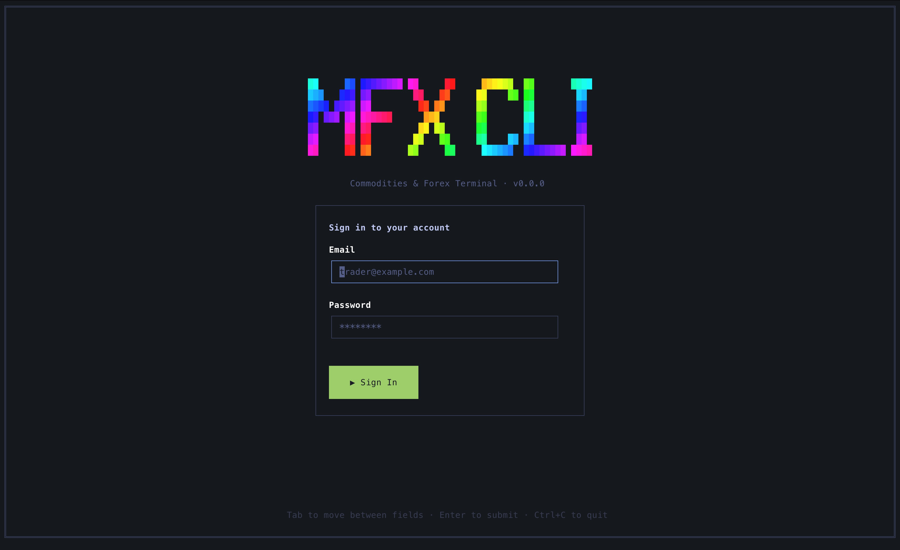
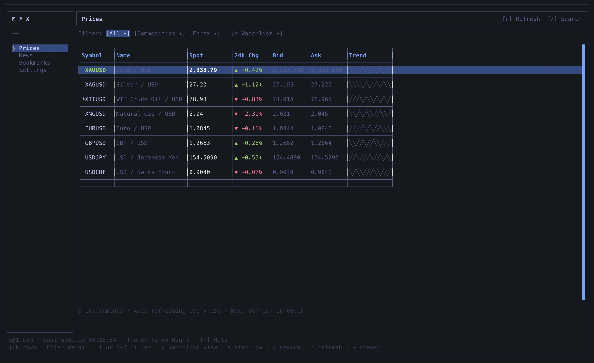
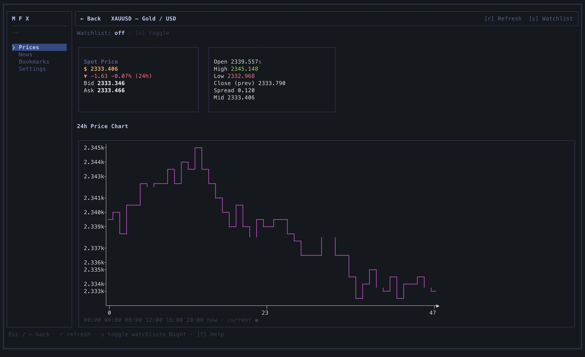
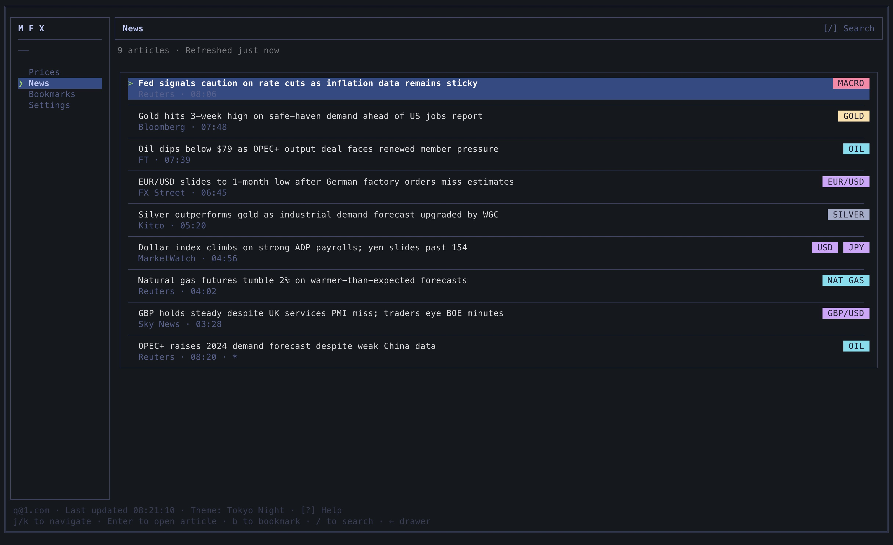

# MFX

**MFX** is a terminal-native market dashboard: live-style commodity and forex quotes, market news, bookmarks, and a watchlist — all rendered in your shell with keyboard-driven navigation. It is a demo/prototype built to show how far you can push a rich product UI inside the terminal using React and [Ink](https://github.com/vadimdemedes/ink).

## Screenshots

### Login



Sign in with any email and any password (except the literal string `wrong`, which triggers a mock auth error). Session state is stored locally so you stay signed in between runs.

### Prices



Browse commodities (gold, silver, oil, gas) and forex pairs with spot, bid/ask, 24h change, and inline sparklines. Filter by asset class, search symbols, star favorites into a watchlist, and refresh on demand.

### Price detail



Drill into a single instrument for a larger ASCII chart, quote strip, and history context.

### News



Scroll a tagged news feed, open full articles, and save stories to bookmarks for later.

## The idea

Most trading and market tools assume a browser or desktop app. MFX explores the opposite: **stay in the terminal** for quick checks — prices, headlines, saved articles — without leaving your workflow. The data is mocked (seeded instruments and articles that jitter on a timer), but the interaction model is real: auth gate, first-run setup, sidebar navigation, overlays, search, and persistent config on disk.

Use it as:

- A reference Ink + React terminal app with multiple screens and themes
- A playground for the shared UI component library under `components/ui/`
- A starting point if you later wire real price/news APIs

## Stack

| Layer         | Technology                                                                                            |
| ------------- | ----------------------------------------------------------------------------------------------------- |
| Runtime       | Node.js 22+ (ES modules; matches Ink 7)                                                               |
| CLI           | [meow](https://github.com/sindresorhus/meow) — flags and help                                         |
| Terminal UI   | [Ink](https://github.com/vadimdemedes/ink) 7 — React for the command line                             |
| UI framework  | React 19                                                                                              |
| Language      | TypeScript (compiled to `dist/`)                                                                      |
| Charts        | [simple-ascii-chart](https://www.npmjs.com/package/simple-ascii-chart) — sparklines and detail charts |
| Markdown      | [marked](https://marked.js.org/) — article bodies in the terminal                                     |
| Testing       | [AVA](https://github.com/avajs/ava)                                                                   |
| Lint / format | [XO](https://github.com/xojs/xo) + Prettier                                                           |

The app uses the terminal **alternate screen** (`\u001B[?1049h`) so the full UI owns the viewport and restores your shell on exit.

## Features

- **Authentication** — mock login with token persisted in config; logout from settings
- **First-run setup** — pick a color theme from several terminal palettes (Catppuccin, Dracula, Tokyo Night, Gruvbox, Nord, One Dark, Solarized, Kanagawa, and more)
- **Prices** — list, filter, search, watchlist (`s` / `v`), manual refresh (`r`), detail view with chart
- **News** — feed, search, article detail, bookmark from an article
- **Bookmarks** — saved articles stored in `bookmarks.json`
- **Settings** — theme, refresh intervals, logout, reset demo data
- **Keyboard-first** — `j`/`k` navigation, `/` search, `Esc` back, shortcuts help in the shell

## Requirements

- A TTY terminal (macOS Terminal, iTerm2, Windows Terminal, etc.)
- Node.js **22** or newer (Ink 7 requires Node ≥22)

## Install & run

From [npm](https://www.npmjs.com/package/@billymcdowell/mfx):

```bash
npx @billymcdowell/mfx
```

Or install globally (the CLI command stays `mfx`):

```bash
npm install -g @billymcdowell/mfx
mfx
```

From the repository:

```bash
npm install
npm run dev
```

Or build and run the compiled CLI:

```bash
npm run build
node dist/source/cli.js
```

Link globally during development:

```bash
npm link
mfx
```

## CLI

```bash
mfx                 # start the app (alternate screen when stdout is a TTY)
mfx --reset-config  # delete local config, bookmarks, and price favorites, then start
```

## Configuration

State is written under:

- **macOS / Linux:** `~/.config/mfx/`
- **Windows:** `%APPDATA%\mfx\`

Override the directory with `MFX_CONFIG_DIR`.

| File                   | Purpose                                          |
| ---------------------- | ------------------------------------------------ |
| `config.json`          | Auth token, theme, refresh intervals, setup flag |
| `bookmarks.json`       | Saved news articles                              |
| `price-favorites.json` | Watchlist symbols                                |

## Project layout

```
source/
  cli.tsx              # Entry: meow flags, alternate screen, Ink render
  app.tsx              # Providers and auth/setup/shell routing
  screens/             # Login, setup, prices, news, bookmarks, settings, details
  context/             # Auth, config, router, prices, news, bookmarks, viewport
  mocks/market.ts      # Seed instruments & articles; price jitter
  lib/                 # Paths, storage, formatting, spark trends
components/ui/         # Reusable Ink UI primitives (tables, charts, sidebar, etc.)
lib/terminal-themes/   # Theme token definitions
images/                # Screenshots for this readme
```

## Development

```bash
npm run dev          # tsx watch — fastest iteration
npm run build        # tsc + path alias rewrite
npm test             # build then AVA
npm run lint         # Prettier + XO
```

### Releases & versioning ([Changesets](https://github.com/changesets/changesets))

When a pull request should produce an npm release after it merges to `main`, add a changeset:

```bash
npm run changeset
```

Pick **patch**, **minor**, or **major** and write a short summary; skip adding a changeset if the PR should not bump the published version.

After merge, GitHub Actions opens or updates a **Version Packages** PR; merging that PR publishes `@billymcdowell/mfx` and updates `CHANGELOG.md`.

**Maintainers:** configure an npm automation token as the repository secret `NPM_TOKEN` (GitHub → Settings → Secrets and variables → Actions) so the release workflow can publish.

## License

MIT — see [LICENSE](LICENSE).
